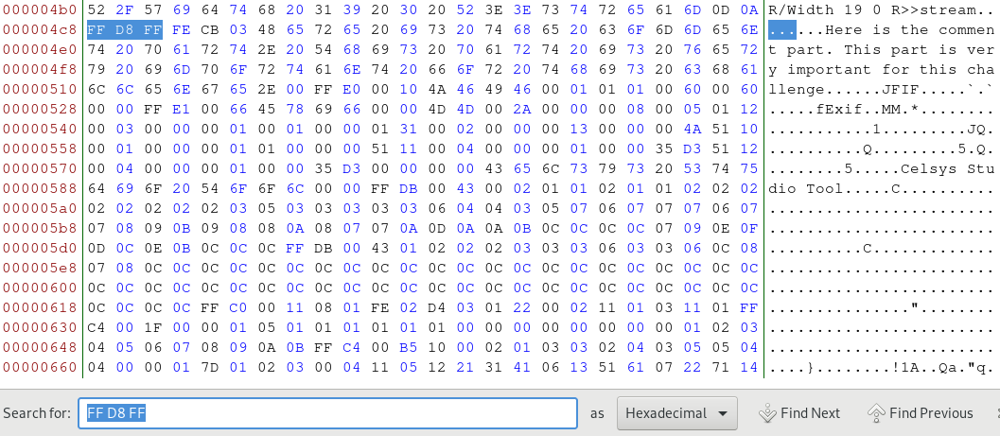
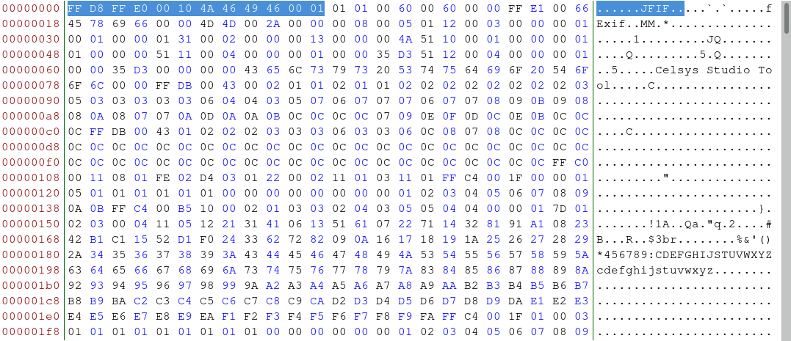
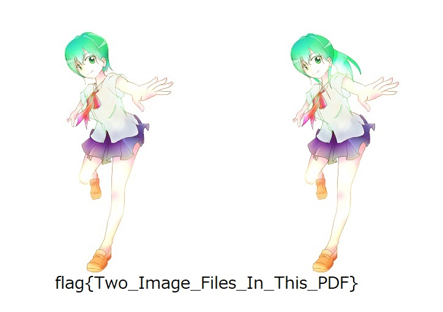

# PDF-JPGS (120 pts)

## PART 1 : CHALLENGE DESCRIPTION

```
Your friend who calls himself a hacker sent you the following message with a PDF file attached.

Can you see a difference between these two image files?

Two images that look completely ordinary are pasted in the PDF file, and it is highly unlikely that these files are normal.
Find a flag in this PDF file.

flag format: flag{[A-Za-z_]}
```

---

## PART 2 : GIVEN FILES

[>] [PDF-JPGS_d1633b9cc9fac22736e29a63eec14771.pdf](./files/PDF-JPGS_d1633b9cc9fac22736e29a63eec14771.pdf)

---

## PART 3 : GETTING THE FLAG

The PDF contains an image


And running __`binwalk`__ gives you:

```console
$ binwalk PDF-JPGS_d1633b9cc9fac22736e29a63eec14771.pdf

  DECIMAL       HEXADECIMAL     DESCRIPTION
  --------------------------------------------------------------------------------
  0             0x0             PDF document, version: "1.6"
  1332          0x534           TIFF image data, big-endian, offset of first image directory: 8
  53228         0xCFEC          TIFF image data, big-endian, offset of first image directory: 8

```

Still nothing seems out of the ordinary but opening the file in a __hex editor__ and searching for a __JPG File Header__ (__`FF D8 FF __`__) leads you to this:

```console
$ bless PDF-JPGS_d1633b9cc9fac22736e29a63eec14771.pdf
```



One possible file header for JPG files is __`FF D8 FF E0 00 10 4A 46 49 46 00 01`__ or __`ÿØÿà..JFIF..`__

Between the earlier detected signature and the __`JFIF`__ string is a string which says:


Delete the comment and make the header __`FF D8 FF E0 00 10 4A 46 49 46 00 01`__ then delete everything above it so the file begins with the new JPG header:



Saving the new hexdump as __`flag.jpg`__ returns a new image:



---

## FLAG : __flag{Two_Image_Files_In_This_PDF}__
