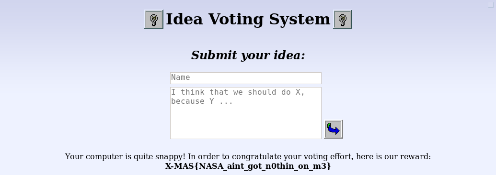

# <span style="color:red">Rigged Election (50 pts)</span>

---

## PART 1 : CHALLENGE DESCRIPTION

```
Come one, come all! We've opened up a brand new website that allows the Lapland people to vote the next big town hall project! Just upload your ideas on the platform and vote using your CPU power. We've made sure voting takes a great amount of effort, so there's no easy way to play the system.

If you are indeed able to vote more than 250 times, you will be congratulated as an active Lapland citizen and receive a prize worthy of this title.

Remote server: http://challs.xmas.htsp.ro:11001
Author: Milkdrop
Note: The ideas you post are public and logged, posting any X-MAS flags may disqualify your team
Note 2: You must send all 250 votes from the same PHP session, otherwise the server will not be able to send you the flag.
```

---

## PART 2 : VIEWING THE SOURCE

Opening the web application leads you to this page:


The goal is to vote for an idea by pressing <strong style="color:orange">I agree</strong> or <strong style="color:orange">I disagree</strong> more than 250 times using the same session ID.

But how does the voting work?

```html
<div class="idea special">
	<b class="name">jebidiah</b> / 811 Points
	<div class="vote">
						
		<div class="agree" onclick="vote(19863, 1)">(I agree)</div> / 
						
		<div class="disagree" onclick="vote(19863, 0)">(I disagree)</div>
	</div>
	<div class="ideaText">bakanaman</div>
</div>

...omitted...

<script src="/index.js"></script>
```

Voting triggers a __`vote()`__ function which uses the idea ID and a boolean value as parameters.

Looking at the included javascript file:

```js
function generateRandom (length) {
    var result = '';
    var characters = 'ABCDEFGHIJKLMNOPQRSTUVWXYZabcdefghijklmnopqrstuvwxyz0123456789';
    var charactersLength = characters.length;

    for (var i = 0; i < length; i++)
        result += characters.charAt (Math.floor (Math.random () * charactersLength));

        return result;
}

function vote (id, upvote) {
    var xhttp = new XMLHttpRequest ();
    xhttp.open ("GET", "/vote.php?g=1", false);
    xhttp.send ();
    var work = xhttp.responseText;

    var statusElement = document.getElementById ("status");
    statusElement.className = "status";
    statusElement.innerText = "CPU Voting on Idea #" + id + " ...";

    var found = false;
    while (!found) {
	var randomLength = Math.floor (7 + Math.random () * 18);
	var stringGen = generateRandom (randomLength);
	var md5Gen = md5 ("watch__bisqwit__" + stringGen);

	if (md5Gen.substring (0, work.length).localeCompare (work) === 0) {
	    var url = "/vote.php?id=" + id + "&h=" + stringGen;
	    if (upvote === 1)
		url += "&u=1";

	    xhttp.open ("GET", url, false);
	    xhttp.send ();
	    found = true;
	}
    }

    location.href = "/";
}
```

### PROGRAM FLOW

1. A request to __`/vote.php?g=1`__ is made to get __`work`__ (a 6 character long hex string) 
2. A random string with characters from __`[a-zA-Z0-9]`__ and with length 7-25 is generated.
3. The randomly generated string id concatenated to the string <strong>`watch__bisqwit__`</strong>
4. The newly formed string is then hashed using MD5 and if its first 6 characters matches with __`work`__, the vote is counted.

The value of __`work`__ changes with each attempt to vote.

---

## PART 3 : GETTING THE FLAG

```py
import hashlib
import requests as r

#session = { "PHPSESSID": "s5jb4edoqsl1njt0jcnhkgtks1" }
session = { "PHPSESSID": "d9lie5oloqadnfrjlvrnhdaouj" }

def get_work():

    work = r.get("http://challs.xmas.htsp.ro:11001/vote.php?g=1", cookies=session)
    
    return str(work.text)

def generate_work(stringGen):

    md5 = hashlib.md5()
    md5.update(bytes("watch__bisqwit__" + stringGen))
    md5_hex = str(md5.hexdigest())

    return md5_hex[:6]

def main():

    characters = 'ABCDEFGHIJKLMNOPQRSTUVWXYZabcdefghijklmnopqrstuvwxyz0123456789'
    length = 6
    char_indices = [0 for x in range(0, length)]

    vote_ctr = 0
    possible_works = dict()
    while vote_ctr < 252:

        work = get_work()

        while True:

            stringGen = possible_works.get(work, False)

            if stringGen:
                data = { "id": 19863, "h": stringGen, "u": 1 } 
                req = r.get("http://challs.xmas.htsp.ro:11001/vote.php", params=data, cookies=session)
                vote_ctr += 1

                print(vote_ctr, work, possible_works[work])
                print(req.text)
                break

            else:
                stringGen = "".join([characters[x] for x in char_indices])

                new_work = generate_work(stringGen)

                if possible_works.get(new_work, True):
                    possible_works.setdefault(new_work, stringGen)

                char_indices[-1] += 1
                for x in range(length-1, 0, -1):
                    if char_indices[x] == len(characters): 
                        char_indices[x] = 0
                        char_indices[x-1] += 1

if __name__ == '__main__': main()
```

My solution initializes an empty dictionary which is serve as a lookup table for found "__`work`__" values; otherwise, the program will add unique "__`work`__" values to the dictionary until the required value is found.

Executing the program:

```shell
(199, 'e25810', 'ADCV2Y')
Your md5 is: e25810e0ac4307b0eb6ad372259b95ae<br>Work required is: e25810<br>Work confirmed. Your vote has been registered.
(200, '39f8ad', 'ABh1Yl')
Your md5 is: 39f8adc872b073969742aa611cc513e1<br>Work required is: 39f8ad<br>Work confirmed. Your vote has been registered.
(201, '2d590f', 'AA5O4y')
Your md5 is: 2d590f28ab656e81f30a9b7ab937f6ba<br>Work required is: 2d590f<br>Work confirmed. Your vote has been registered.
(202, 'f94710', 'AAHOJv')
Your md5 is: f94710ed72c9c86b752fc59937a51db2<br>Work required is: f94710<br>Work confirmed. Your vote has been registered.
(203, '8cb7a2', 'ABF0vM')
Your md5 is: 8cb7a2d386f3fd72e0ef89e006c91c2f<br>Work required is: 8cb7a2<br>Work confirmed. Your vote has been registered.
(204, '40c367', 'AAe1Jy')
Your md5 is: 40c367d81026896b6c9ca6ff9511a7b1<br>Work required is: 40c367<br>Work confirmed. Your vote has been registered.
(205, '83491d', 'ABDCe7')
Your md5 is: 83491dffa9597ac9bff79b0c7cec0bcc<br>Work required is: 83491d<br>Work confirmed. Your vote has been registered.
(206, 'd4aef2', 'AEFEkZ')
Your md5 is: d4aef2796d5d40093d63be6bd8a5cd23<br>Work required is: d4aef2<br>Work confirmed. Your vote has been registered.
(207, '3187d0', 'AA5gj8')
Your md5 is: 3187d085884578273467eda5f61b554e<br>Work required is: 3187d0<br>Work confirmed. Your vote has been registered.
(208, 'f358ea', 'ACBhv8')
Your md5 is: f358ea5338abfe00f7fa262263144df9<br>Work required is: f358ea<br>Work confirmed. Your vote has been registered.
(209, '041ca5', 'ACsDY9')
Your md5 is: 041ca5eed5801155bb0323b4379f4c81<br>Work required is: 041ca5<br>Work confirmed. Your vote has been registered.
(210, 'd536e1', 'AAAu5b')
Your md5 is: d536e1856b834891f5f3bd23984fe6e3<br>Work required is: d536e1<br>Work confirmed. Your vote has been registered.
(211, 'd6e5ac', 'ABDOTg')
Your md5 is: d6e5ac73375f55d8974270bed9d6c601<br>Work required is: d6e5ac<br>Work confirmed. Your vote has been registered.
(212, '896cfa', 'AAaD59')
Your md5 is: 896cfaf0d18c41a1ecb5b9af788d1cd8<br>Work required is: 896cfa<br>Work confirmed. Your vote has been registered.
(213, '73189e', 'ABIdrf')
Your md5 is: 73189ed7a28a4906176dcc5c85e72ba8<br>Work required is: 73189e<br>Work confirmed. Your vote has been registered.
(214, '5263ab', 'ABbPSI')
Your md5 is: 5263abf6d3bcd8b018162b1dc734f68a<br>Work required is: 5263ab<br>Work confirmed. Your vote has been registered.
(215, '823c6d', 'AAmoNa')
Your md5 is: 823c6da3d235e6cda95cbfbf06d00222<br>Work required is: 823c6d<br>Work confirmed. Your vote has been registered.
(216, '06f182', 'ABZSrF')
Your md5 is: 06f182f1debc17a57e57b129e8f2a575<br>Work required is: 06f182<br>Work confirmed. Your vote has been registered.
(217, 'e17963', 'AJIGSz')
Your md5 is: e17963c13643cc7dd550c4f50e9dada8<br>Work required is: e17963<br>Work confirmed. Your vote has been registered.
(218, '21a58f', 'ACZ8pn')
Your md5 is: 21a58f1a316d46efbaab9b72fd2ed9b8<br>Work required is: 21a58f<br>Work confirmed. Your vote has been registered.
(219, 'e5f301', 'AAiTZE')
Your md5 is: e5f30138b55a61a0160dab1c8854534a<br>Work required is: e5f301<br>Work confirmed. Your vote has been registered.
(220, '86327b', 'AABXOz')
Your md5 is: 86327ba71421e4f15a12e68014964deb<br>Work required is: 86327b<br>Work confirmed. Your vote has been registered.
(221, 'd04195', 'ABKm3I')
Your md5 is: d04195c1e36578086d025cfa58704fc7<br>Work required is: d04195<br>Work confirmed. Your vote has been registered.
(222, 'b3108a', 'ABEHVu')
Your md5 is: b3108aa40efdcae667cd12580331cef0<br>Work required is: b3108a<br>Work confirmed. Your vote has been registered.
(223, 'e79b14', 'AAINhM')
Your md5 is: e79b14fbfb48e6cb9e40ffc6a0522093<br>Work required is: e79b14<br>Work confirmed. Your vote has been registered.
(224, '14d579', 'AAhXC7')
Your md5 is: 14d5791141fdab3519fbf91184a1bce6<br>Work required is: 14d579<br>Work confirmed. Your vote has been registered.
(225, '1a378f', 'AAImvS')
Your md5 is: 1a378f8c602351fa2ac09e87777230de<br>Work required is: 1a378f<br>Work confirmed. Your vote has been registered.
(226, '9a03de', 'AAMelU')
Your md5 is: 9a03defc2743a605a01860e1d7885b75<br>Work required is: 9a03de<br>Work confirmed. Your vote has been registered.
(227, 'd69a1c', 'AEMBAR')
Your md5 is: d69a1c1c3d6c6b27419605624ca113e6<br>Work required is: d69a1c<br>Work confirmed. Your vote has been registered.
(228, '06349e', 'AA29f4')
Your md5 is: 06349e1b27f7d87fc8e477f9cbb4d9d8<br>Work required is: 06349e<br>Work confirmed. Your vote has been registered.
(229, 'ce4d56', 'ACH3ij')
Your md5 is: ce4d56d2ee7b206864191795be555d64<br>Work required is: ce4d56<br>Work confirmed. Your vote has been registered.
(230, 'ac210d', 'ACphHF')
Your md5 is: ac210dd089b4a95781b638d0e72dce25<br>Work required is: ac210d<br>Work confirmed. Your vote has been registered.
(231, 'abdcf2', 'AAwyDF')
Your md5 is: abdcf2a27c60e6cd8c90bb2381b857d6<br>Work required is: abdcf2<br>Work confirmed. Your vote has been registered.
(232, '2e6fa7', 'AALEgC')
Your md5 is: 2e6fa789c2d62aec8c4043a256c8b1dd<br>Work required is: 2e6fa7<br>Work confirmed. Your vote has been registered.
(233, 'be3a81', 'AC72a4')
Your md5 is: be3a81655a10622d30946a1ba33961c3<br>Work required is: be3a81<br>Work confirmed. Your vote has been registered.
(234, 'b2f8cd', 'AAUWRl')
Your md5 is: b2f8cd836d97ae228b5b32623384b85d<br>Work required is: b2f8cd<br>Work confirmed. Your vote has been registered.
(235, 'e5b8ac', 'AASjX6')
Your md5 is: e5b8ac4581129b925175549e2cafa10a<br>Work required is: e5b8ac<br>Work confirmed. Your vote has been registered.
(236, '039fd7', 'AAD4yL')
Your md5 is: 039fd7a2519092980eeacd5d7ca7b64b<br>Work required is: 039fd7<br>Work confirmed. Your vote has been registered.
(237, '95e0a2', 'AAVwZX')
Your md5 is: 95e0a2c231a4df83c839d507089ed2e3<br>Work required is: 95e0a2<br>Work confirmed. Your vote has been registered.
(238, '260df1', 'ABn7wD')
Your md5 is: 260df14c25dc5c817483779d589732da<br>Work required is: 260df1<br>Work confirmed. Your vote has been registered.
(239, '1c9d38', 'ABKBmM')
Your md5 is: 1c9d38a88edcade21c241897376c6acb<br>Work required is: 1c9d38<br>Work confirmed. Your vote has been registered.
(240, '5b4a16', 'AA1nzJ')
Your md5 is: 5b4a1668046308f403ede1a164b22fc8<br>Work required is: 5b4a16<br>Work confirmed. Your vote has been registered.
(241, '97a4d2', 'ABK4Ua')
Your md5 is: 97a4d24e5b28e1c3ca53fd7bad1365ed<br>Work required is: 97a4d2<br>Work confirmed. Your vote has been registered.
(242, '623e95', 'ABRhcT')
Your md5 is: 623e95190811435da9cf6350f9aadd45<br>Work required is: 623e95<br>Work confirmed. Your vote has been registered.
(243, '098157', 'ACTXzx')
Your md5 is: 0981574288f437cba970575f1186c710<br>Work required is: 098157<br>Work confirmed. Your vote has been registered.
(244, 'f49b03', 'ABHyXq')
Your md5 is: f49b036fa611e0fce1f0ed947ff212b6<br>Work required is: f49b03<br>Work confirmed. Your vote has been registered.
(245, 'f8c697', 'ABkUCq')
Your md5 is: f8c69736ffda7e1b08d32767d1449685<br>Work required is: f8c697<br>Work confirmed. Your vote has been registered.
(246, 'f6d8e5', 'AAWAIp')
Your md5 is: f6d8e5dc8be18b7cd2239f687ff58f8d<br>Work required is: f6d8e5<br>Work confirmed. Your vote has been registered.
(247, '0df37b', 'AAHPmE')
Your md5 is: 0df37b1da1f19ba979b9a1830a26e55c<br>Work required is: 0df37b<br>Work confirmed. Your vote has been registered.
(248, 'b342f1', 'ABtRnJ')
Your md5 is: b342f194116e3a8c256e32bee0a482b1<br>Work required is: b342f1<br>Work confirmed. Your vote has been registered.
(249, '526bed', 'AA10ec')
Your md5 is: 526bedf3995272b65e3cccc3811035f0<br>Work required is: 526bed<br>Work confirmed. Your vote has been registered.
(250, '359cd4', 'ACdSvm')
Your md5 is: 359cd4b7639165215f424f70504b66bf<br>Work required is: 359cd4<br>Work confirmed. Your vote has been registered.
(251, '1f29b6', 'AAcVY1')
Your md5 is: 1f29b6a10128ae69db7c6f6982fe54f0<br>Work required is: 1f29b6<br>Work confirmed. Your vote has been registered.
```

Now looking back at the idea posted:


And requesting the page once again with the __`PHSSESSID`__ used for voting:



---

<div style="width:100%;overflow-x:auto"><h2>FLAG : <strong>X-MAS{NASA_aint_got_n0thin_on_m3}</strong></h2></div>
