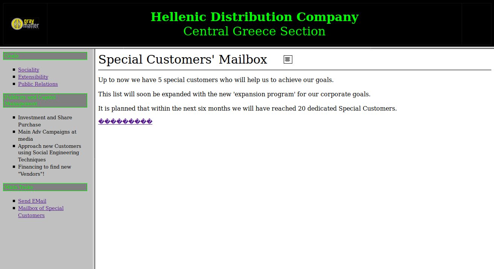
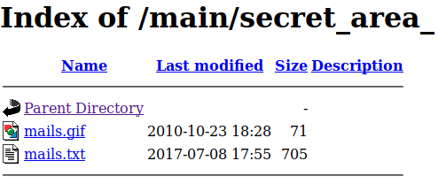
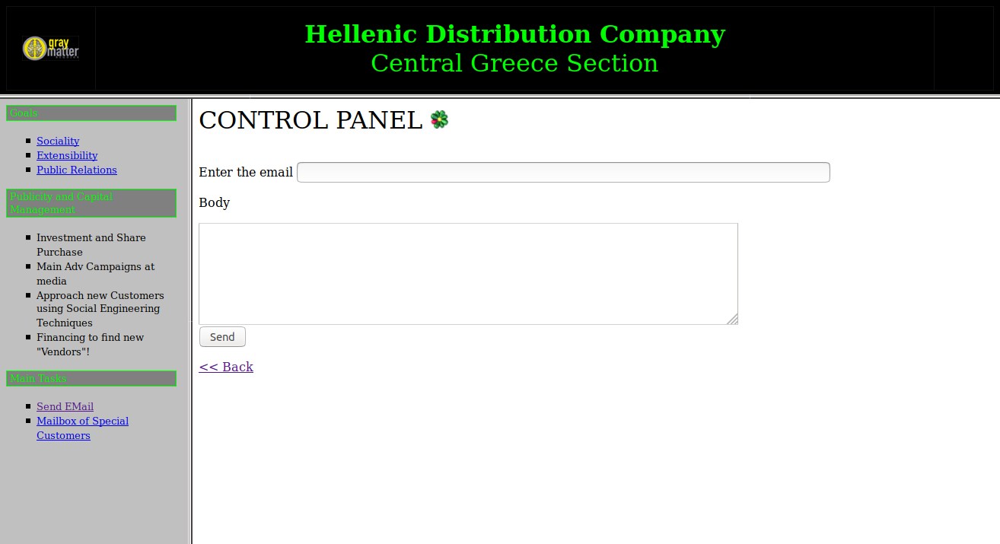

# HDC Web Challenge (30 pts)

## PART 1 : CHALLENGE DESCRIPTION

```
We believe a certain individual uses this website for shady business. Can you find 
out who that is and send him an email to check, using the web site's functionality?

Note: The flag is not an e-mail address.
```

---

## PART 2 : RECONNAISSANCE

### Login Page

- Landing Page:
  
  

- Page Source:
  - Input Form:
    ```html
    <form id='formaki' name='formaki' action="./main/index.php" method="post">
      <p align="center">Enter Username / Password
        <input type="text" name="name1" size="20">
        <input type="text" Name="name2" size="20">
      </p>

      <p align="center">
        <input type="hidden" value= name="name1">
        <input type="hidden" value= name="name2">

        <input type="button" value="Submit" onclick="doProcess()"/>
      </p>
    </form>
    ```
    __NOTE(S)__:
    1. The form submission is handled by a function `doProcess()`.
       - `onclick=` is always referenced to a JS script
    2. There are two hidden inputs -- `name1` and `name2`.

  - Included Scripts:
    ```html
    <script src="jquery-3.2.1.js"></script>
    <script src="myscripts.js"></script>
    ```
    __NOTE(S)__:
    1. `myscripts.js`:
       ```js
       function doProcess()
       {
	   document.forms["formaki"].submit();
       }
       ```
    2. `jquery-3.2.1.js`:
       ```js
       // ...omitted...
       function doProcess() {
           var form = document.createElement("form");
           form.setAttribute("method", "post");
           form.setAttribute("action", "main/index.php");
           form.setAttribute("target", "view");
           var hiddenField = document.createElement("input");
           hiddenField.setAttribute("type", "hidden");
           hiddenField.setAttribute("name", "name1");
           hiddenField.setAttribute("value", "TXlMaXR0bGU");
           var hiddenField2 = document.createElement("input");
           hiddenField2.setAttribute("type", "hidden");
           hiddenField2.setAttribute("name", "name2");
           hiddenField2.setAttribute("value", "cDB3bmll");
           form.appendChild(hiddenField2);
           form.appendChild(hiddenField);
           form.appendChild(hiddenField2);
           document.body.appendChild(form);
           window.open('', 'view');
           form.submit();
       }
       // ...omitted...
       ```
       - It's very notable that the included jquery file was not __*minified*__.
       - It also includes a function definition of `doProcess()`:
         - It sets the hiddent inputs, `name1` and `name2`, to `TXlMaXR0bGU` and `cDB3bmll` respectively.
         - `name1` and `name2` are also input names for the username and password in the login form's user input.

---

## PART 3 : FINDING THE FLAG

1. Login using the credentials, __`TXlMaXR0bGU`__:__`cDB3bmll`__

   
   
   __NOTE(S)__:
   1. The page sections are loaded using __HTML Frames__.
   2. There is a section of the page named __`Mailbox of Special Customers`__:
      - According to the challenge description, the objective is to find the an e-mail address and then inbox the individual.
      - Since an e-mail address is still yet to be found, it must be imperative to explore this section.

2. Explore __`Mailbox of Special Customers`__:

   

   - Frame Source:
     ```html
     <html>
       <meta http-equiv="Content-Type" content="text/html; charset=windows-1253">
       <meta http-equiv="Content-Language" content="us">
       <meta name="ProgId" content="FrontPage.Editor.Document">

       <font size="6"><span lang="en-us">Special Customers' Mailbox</font>
       <b><font size="6">&nbsp;&nbsp;&nbsp; </font></b>
       <body>
         
       </body>
       <hr>
       <p><body></p>
         <p>
           Up to now we have 5 special customers who will help us to achieve our goals.<br><br>
           This list will soon be expanded with the new 'expansion program' for our corporate goals.<br><br>
           It is planned that within the next six months we will have reached 20 dedicated Special Customers.<br>
         </p>
         <p><span lang="us"><a href="main.htm">���������</a></span></p>
       </body>
     </html>
     ```
   __NOTE(S)__:
   1. A GIF is loaded using from a directory, __`./secret_area_`__:
      ```html
      
      ```

3. Navigate to __`http://docker.hackthebox.eu:<port>/main/secret_area_`__:
   
   

   - __`mail.txt`__:
     ```
     All good boys are here... hehehehehehe!
     ----------------------------------------
     Peter Punk CallMePink@newmail.com
     Nabuchodonosor BabyNavou@mailpost.gr
     Ilias Magkakos imagkakos@badmail.com
     Nick Pipshow NickTheGreek@mail.tr.gr
     Don Quixote Windmill@mail.gr 
     Crazy Priest SeVaftise@hotmail.com
     Fishroe Salad fishroesalad@mail.com
     TaPanta Ola OlaMaziLeme@mail.gr
     Laertis George I8aki@mail.gr
     Thiseas Sparrow Pirates@mail.gr
     Black Dreamer SupaHacka@mail.com
     Callme Daddy FuckthemALL@mail.com
     Aggeliki Lykolouli FwsStoTounel@Traino.pourxetai
     Kompinadoros Yannnnis YannisWith4N@rolf.com
     Serafino Titamola Ombrax@mail.gr
     Joe Hard Soft@Butter.gr
     Bond James MyNameIsBond@JamesBond.com
     Endof Text EndOfLine@mail.com
     ```
     __NOTE(S)__:
     1. A list of names and e-mails have now been found.
     2. There is a section named __`Send EMail`__:
        - Since the objective is to send a shady guy an e-mail, this should be the final step towards the flag.

4. Send an e-mail to the listed users in __`mail.txt`__:
   - Mailing Form:   

     

   - After sending an e-mail to __`fishroesalad@mail.com`__:

     

---

## FLAG : HTB{FuckTheB3stAndPlayWithTheRest!!}
